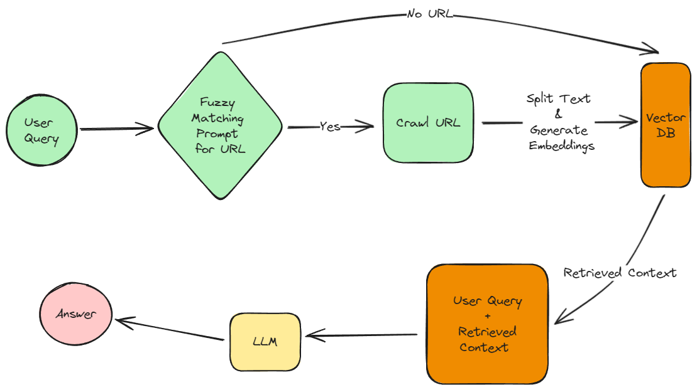

# Dynamic RAG Chatbot with Web Crawling

An AI assistant that dynamically learns from **web pages** using **retrieval-augmented generation (RAG)**.  

---

## 🛠️ Technologies Used
- **PipeCat** 🐈 → Building Pipeline
- **Daily** 💬 → Chatroom
- **LangChain** 🦜🔗 → Prompt chaining, retriever, and memory  
- **FAISS** 🏪 → In-memory vector database for storing embeddings  
- **all-MiniLM-L6-v2  Embeddings** 🤖 → Text vectorization  
- **ChatCohere** 🧠 → Language model for generating responses  
- **BeautifulSoup** 🍜 → Web scraping for learning new knowledge  
- **Python** 🐍 → The foundation of our AI chatbot  

---
## Architecture

<br>

---

## Pipeline

- ```DailyTransport``` initializes the Daily Chat room (```transport```).
- Pipecat binds together the agentic Flow as a Pipecat pipeline.
```
 pipeline = Pipeline([
        transport.input(),
        tma_in,
        lc,
        tma_out
    ])
```
- ```tma_in``` maintains the user context, while ```tma_out``` stores the LLM's responses or assistant context.
- ```lc``` encapsulates a LangChain Retrieval Chain within the ```LLMUserResponseAggregator``` customized as ```LangchainRAGProcessor```, to implement fuzzy logic matching for URLs and trigger web crawling.
- The pipeline is initiated via the ```on_chat_message``` listener on ```transport```, which starts the Pipecat pipeline.

---

## 📥 Setup

### 1️⃣ Set up environment variables
Add config in .env (.env_example for reference)

### 2️⃣ Setup Poetry Virtual Environment
```bash
poetry install
```

### 3️⃣ Start the Embedding Server
```
docker compose up
```

### 4️⃣ Run the rag_chatbot_server.py
```bash
py rag_chatbot_server.py
```


